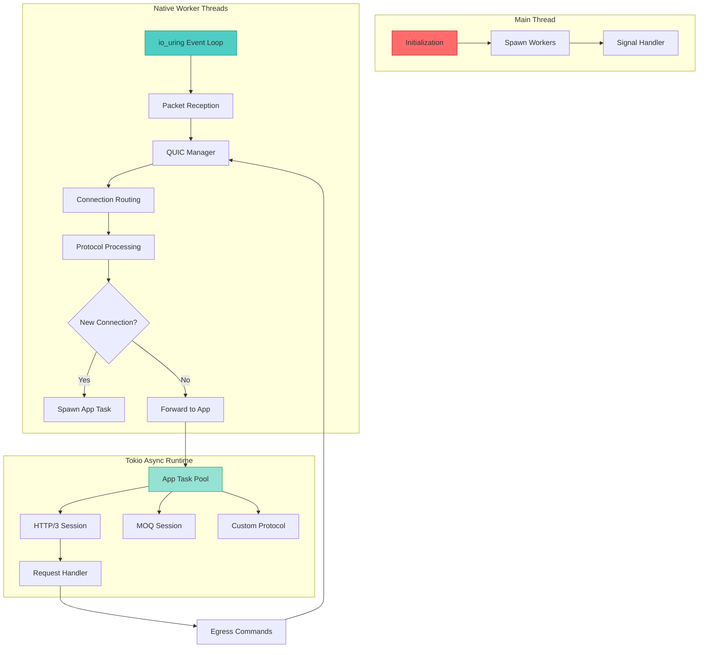

QuicD's architecture is designed around a single principle: **eliminate contention to maximize performance**. This page explores the multi-layered design, threading model, and data flow that enables QuicD to handle hundreds of thousands of concurrent connections with minimal latency.

## High-Level Overview

QuicD separates concerns into distinct layers, each optimized for its specific role:



**Key separation:**
- **Main thread**: Orchestration, initialization, shutdown
- **Worker threads**: Synchronous, event-driven network I/O and QUIC protocol
- **Tokio runtime**: Asynchronous application logic (HTTP/3, MOQ, custom)

This separation ensures that application logic never blocks network processing, and network processing never waits for application tasks.

## Component Layers

### Layer 1: Network I/O (`netio/`)

The network I/O layer provides zero-copy packet reception and transmission via Linux io_uring.

#### Key Components

**Buffer Pool Management**
- Each worker has a **dedicated buffer pool** (2-8K buffers, configurable)
- Buffers are pre-allocated on startup to eliminate runtime allocation
- Zero-copy design: Buffers passed by reference between layers
- NUMA-aware allocation for multi-socket systems (optional)

**UDP Socket Creation**
- `SO_REUSEPORT` enables multiple workers to bind the same address/port
- Kernel performs hardware-assisted load balancing across worker sockets
- Each worker has its own socket file descriptor

**io_uring Integration**
- Submission queue: Worker submits recv/send operations
- Completion queue: Kernel reports completed operations
- Batch processing: Multiple operations submitted/completed per syscall
- Typical queue depth: 4096 entries (configurable)

```rust
// Conceptual buffer pool usage
let mut pool = WorkerBufPool::new(8192, 2048); // 8192 buffers, 2KB each
let buffer = pool.acquire(); // Get buffer (zero-alloc after warmup)
// ... use buffer ...
pool.release(buffer); // Return to pool
```

#### NUMA Awareness

On multi-socket systems, QuicD can configure workers to allocate memory from local NUMA nodes:

```toml
[netio]
enable_numa = true
```

This ensures memory access patterns are optimized for CPU cache hierarchies, reducing inter-socket memory traffic.

---

### Layer 2: QUIC Protocol (`quic/`)

The QUIC layer integrates Cloudflare's Quiche library, handling all protocol-level operations.

#### QuicManager

The `QuicManager` is the per-worker connection orchestrator:

- **Connection map**: DCID (Destination Connection ID) → Connection state
- **Packet routing**: Identifies which connection owns each incoming packet
- **Connection lifecycle**: Manages handshakes, data transfer, and cleanup
- **Timer management**: Schedules retransmissions and timeout events

```rust
// Conceptual flow
impl QuicManager {
    fn process_ingress(&mut self, packet: &[u8], from: SocketAddr) -> Result<()> {
        // Parse DCID from packet header
        let dcid = extract_dcid(packet)?;
        
        // Route to existing connection or create new
        if let Some(conn) = self.connections.get_mut(&dcid) {
            conn.recv(packet, from)?;
        } else {
            self.accept_connection(packet, from)?;
        }
        
        // Process events and generate responses
        self.process_events()?;
        Ok(())
    }
}
```

#### eBPF Connection Routing

QuicD uses **eBPF (Extended Berkeley Packet Filter)** to ensure connection affinity:

1. When a new connection is accepted, a routing cookie is generated
2. The eBPF program in the kernel is programmed with DCID → worker mapping
3. Subsequent packets for that connection are routed directly to the correct worker
4. This eliminates connection state migration and cross-worker communication

**Why it matters**: Connection affinity means all packets for a connection hit the same CPU cache, dramatically improving throughput.

```bash
# eBPF routing requires CAP_BPF or root
sudo quicd --config config.toml
```

#### Quiche Integration

Quiche provides:
- Full QUIC v1 (RFC 9000) compliance
- TLS 1.3 handshake handling
- Congestion control (Cubic, BBR, etc.)
- Stream multiplexing and flow control
- Loss detection and recovery

QuicD's role is to:
- Feed packets to Quiche: `quiche::Connection::recv()`
- Extract packets from Quiche: `quiche::Connection::send()`
- Handle connection events: streams opened, data readable, etc.
- Spawn application tasks when handshake completes

---

### Layer 3: Application Interface (`quicd-x`)

The `quicd-x` crate defines the **contract** between QuicD's core and pluggable applications.

#### Design Philosophy

**Event-driven, non-blocking**: Worker threads never block on application tasks. All communication is via bounded channels with backpressure.

**Zero-copy data transfer**: Uses `bytes::Bytes` for reference-counted, immutable buffers. Cloning a `Bytes` is O(1) without copying underlying data.

**Separation of concerns**:
- Worker threads: Synchronous, handle network I/O and QUIC protocol
- App tasks: Asynchronous (Tokio), implement application logic
- Channels: Bidirectional, bounded communication

#### Key Types

**QuicAppFactory Trait**

Applications implement this trait to register with QuicD:

```rust
#[async_trait]
pub trait QuicAppFactory: Send + Sync + 'static {
    fn accepts_alpn(&self, alpn: &str) -> bool;
    
    async fn spawn_app(
        &self,
        alpn: String,
        handle: ConnectionHandle,
        events: AppEventStream,
        transport: TransportControls,
        shutdown: ShutdownFuture,
    ) -> Result<(), ConnectionError>;
}
```

**ConnectionHandle**

API for applications to interact with connections:

- `open_bi()`, `open_uni()`: Open streams
- `send_datagram()`: Send unreliable datagrams
- `reset_stream()`: Abort a stream with error code
- `close()`: Gracefully close connection
- `stats()`: Request transport statistics

All operations are **non-blocking** and return a `request_id` for correlation with response events.

**AppEvent Stream**

Worker-to-app event stream:

- `HandshakeCompleted`: Connection established, ALPN negotiated
- `NewStream`: Peer opened a stream (includes `RecvStream` and optional `SendStream`)
- `StreamReadable`: Buffered data available (edge-triggered)
- `ConnectionClosing`: Graceful shutdown initiated
- `StreamOpened`, `DatagramSent`, etc.: Responses to commands

**SendStream / RecvStream**

Zero-copy stream I/O:

```rust
// Reading
while let Ok(Some(StreamData::Data(chunk))) = recv_stream.read().await {
    process(chunk); // chunk: bytes::Bytes (zero-copy)
}

// Writing (fluent API)
send_stream.send_data(response).with_fin(true).send().await?;
```

---

### Layer 4: Application Implementations

#### HTTP/3 (`quicd-h3`)

The HTTP/3 implementation includes:

- **H3Session**: Manages HTTP/3 connection state (control streams, QPACK, requests)
- **QPACK codec**: Header compression (RFC 9204)
- **Frame parser**: Encodes/decodes HTTP/3 frames (HEADERS, DATA, SETTINGS, etc.)
- **H3Handler trait**: Application-level request handling

```rust
// Simplified HTTP/3 flow
impl H3Session<H: H3Handler> {
    async fn run(mut self, events: AppEventStream, shutdown: ShutdownFuture) {
        loop {
            tokio::select! {
                Some(event) = events.next() => {
                    match event {
                        AppEvent::NewStream { recv_stream, send_stream, .. } => {
                            // Parse HEADERS frame
                            let request = self.parse_request(recv_stream).await?;
                            
                            // Delegate to handler
                            self.handler.handle_request(request, send_stream).await?;
                        }
                        _ => {}
                    }
                }
                _ = &mut shutdown => break,
            }
        }
    }
}
```

#### Media over QUIC (`quicd-moq`)

Currently a placeholder. Planned features:
- Track-based media delivery
- Datagram and stream modes
- Congestion-aware bitrate adaptation

---

## Threading Model

### Native Worker Threads

Each worker is a **native OS thread** (not Tokio tasks) with:

- **CPU affinity**: Pinned to specific core via `core_affinity` crate
- **Dedicated resources**:
  - Own buffer pool (8K+ buffers)
  - Own io_uring instance (4K queue depth)
  - Own UDP socket (SO_REUSEPORT)
  - Own QUIC connection manager
- **Event-driven loop**: `io_uring::wait()` → process completions → submit new ops → repeat
- **No shared state**: Zero contention with other workers

**Thread count**: Typically 1 worker per physical CPU core (not hyperthreads).

```toml
[netio]
workers = 8  # For 8-core CPU
```

### Tokio Async Runtime

Separate from worker threads, a **shared Tokio runtime** executes application tasks:

- **One task per connection**: Each active connection has an async task
- **Shared across connections**: Tasks cooperatively share runtime threads
- **Configurable parallelism**: Default is number of CPU cores

```toml
[runtime]
worker_threads = 8  # Tokio runtime threads
```

**Key insight**: Application logic is I/O-bound (waiting on channels), so many tasks can share few threads efficiently.

### Communication: Channels

Workers and app tasks communicate via **bounded channels**:

- **Ingress (worker → app)**: `AppEvent` stream (capacity: 1024)
- **Egress (app → worker)**: `EgressCommand` channel (capacity: 1024)
- **Stream data**: Per-stream channels (capacity: 256 chunks)

**Backpressure**: If a channel fills, the sender blocks. This is by design:
- App too slow? Backpressure prevents memory explosion
- Worker overloaded? Commands queue until capacity is available

```toml
[channels]
egress_capacity = 1024
ingress_capacity = 1024
stream_data_capacity = 256
```

---

## Data Flow

### Ingress (Receiving Data)

1. **UDP packet arrives** at network interface
2. **eBPF program** routes packet to correct worker's socket (if established connection)
3. **io_uring** completes recv operation, wakes worker thread
4. **Worker thread** extracts packet from buffer pool
5. **QuicManager** parses DCID, routes to connection
6. **Quiche** processes packet: updates state, decrypts, delivers stream data
7. **Worker** checks for events: new streams, readable streams, etc.
8. **Worker** sends `AppEvent` to app task via ingress channel
9. **App task** receives event, reads data from `RecvStream` (zero-copy)
10. **App** processes data (e.g., HTTP/3 parses HEADERS frame)

**Zero-copy points**:
- Buffer pool → Quiche: Reference passed
- Quiche → App task: `bytes::Bytes` shared

### Egress (Sending Data)

1. **App task** calls `send_stream.write(data)` or `handle.send_datagram(data)`
2. **Command sent** to worker via egress channel
3. **Worker thread** receives command from channel
4. **Worker** forwards data to Quiche: `quiche::stream_send()` or `send_dgram()`
5. **Quiche** encrypts, frames, and generates UDP packets
6. **Worker** acquires buffer from pool, writes packet data
7. **Worker** submits send operation to io_uring
8. **io_uring** completes send, releases buffer back to pool

**Zero-copy points**:
- App → Worker: `bytes::Bytes` shared
- Worker → io_uring: Direct memory buffer pointer

---

## Performance Optimizations

### Zero-Copy Everywhere

- **Buffer pools**: Pre-allocated, reused across connections
- **bytes::Bytes**: Reference-counted, immutable buffers
- **io_uring**: Kernel directly reads/writes buffer pool memory
- **Channel transfers**: Only buffer metadata (pointers) copied, not data

### CPU Cache Optimization

- **CPU affinity**: Workers pinned to cores → cache locality
- **NUMA awareness**: Memory allocated from local node
- **Connection affinity (eBPF)**: Same connection always hits same cache
- **Prefetching**: Explicit CPU prefetch instructions in hot paths

```rust
// Worker prefetch example
pub fn prefetch_connection_state(conn: &Connection) {
    #[cfg(target_arch = "x86_64")]
    unsafe {
        use std::arch::x86_64::_mm_prefetch;
        let ptr = conn as *const _ as *const i8;
        _mm_prefetch(ptr, _MM_HINT_T0);
    }
}
```

### Batch Processing

- **io_uring batching**: Submit/complete multiple operations per syscall
- **Event processing**: Process all available events before yielding

### Pre-Allocation

- **Buffers**: Allocated on startup, not during packet processing
- **Connection structs**: Pooled and reused (future optimization)
- **Hash maps**: Pre-sized for expected connection counts

---

## Configuration Impact

Key settings and their architectural implications:

| Setting | Layer | Impact |
|---------|-------|--------|
| `netio.workers` | Workers | CPU utilization, connection capacity |
| `netio.buffer_pool_size` | NetIO | Memory footprint, concurrent connections |
| `netio.io_uring_entries` | NetIO | Latency vs. throughput tradeoff |
| `quic.max_connections_per_worker` | QUIC | Per-worker connection limit |
| `channels.egress_capacity` | App Interface | Backpressure threshold |
| `runtime.worker_threads` | Tokio | App task concurrency |

See [Configuration Reference](/reference/configuration/) for detailed tuning.

---

## Scalability Characteristics

QuicD's architecture enables linear scaling:

- **Per-worker**: 100K+ connections (limited by memory, not CPU)
- **Multi-worker**: Add workers to utilize more cores
- **Hardware limits**: Network bandwidth, RAM, CPU cores
- **No shared state**: No contention bottlenecks

**Example capacity calculation**:
- 8 workers × 100K connections = 800K concurrent connections
- 8K buffers/worker × 2KB/buffer × 8 workers = 128MB buffer pool
- Plus connection state: ~1KB/conn × 800K = 800MB
- **Total**: ~1GB RAM for 800K connections (excluding application memory)

---

## Security Considerations

### Privilege Requirements

- **eBPF routing requires `CAP_BPF` or root**: Current implementation uses root for simplicity
- **Future**: Move to capability-based model (`CAP_BPF + CAP_NET_ADMIN`)

### Attack Surface

- **UDP flood**: Kernel-level filtering recommended (iptables, nftables)
- **Connection exhaustion**: Enforced per-worker limits
- **Resource limits**: Buffer pool size caps memory usage

### TLS Security

- Uses Quiche's BoringSSL integration
- TLS 1.3 mandatory (QUIC requirement)
- Certificate validation via standard PKI

---

## Next Steps

- **Understand the interfaces**: See [Core Concepts](/concepts/) for terminology
- **Configure your server**: Jump to [Configuration Guide](/getting-started/configuration/)
- **Build an application**: Read [Building Apps](/building-apps/interface/)

---

*QuicD's architecture is the result of careful design decisions prioritizing zero-contention, zero-copy, and event-driven patterns. Every layer is optimized for its specific role, enabling exceptional performance at scale.*
