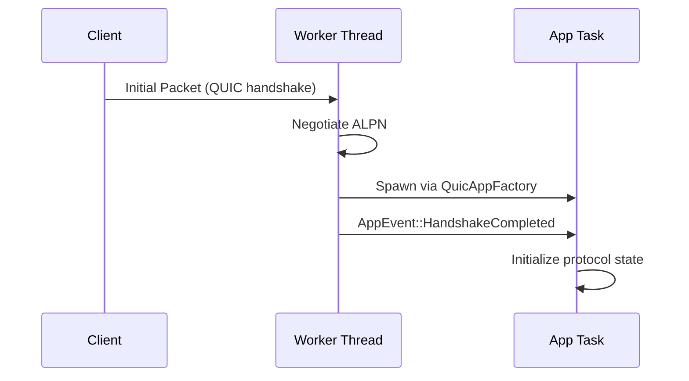
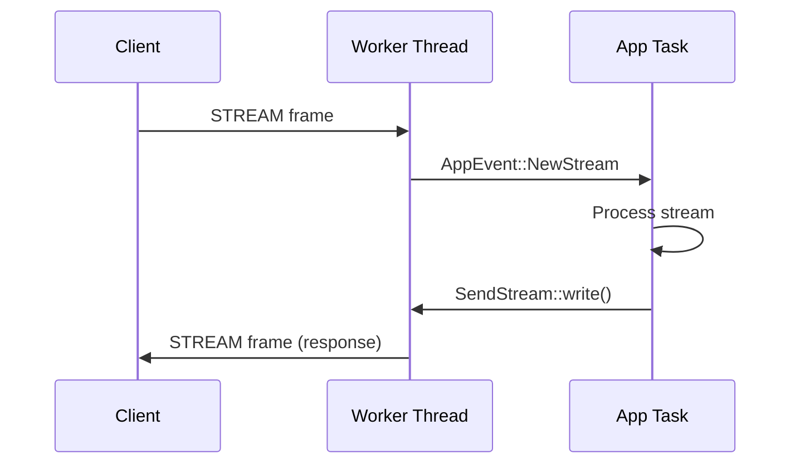
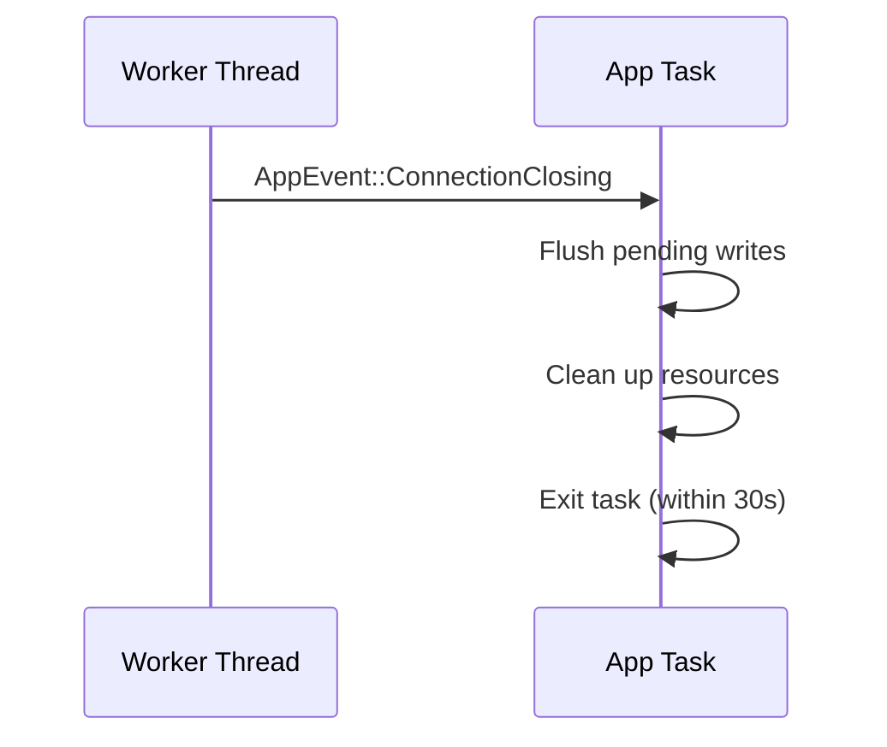

QuicD's application interface (`quicd-x`) provides a clean, event-driven API for building any QUIC-based protocol. This guide covers everything you need to implement custom applications on QuicD.

## Overview

Building an application on QuicD involves:

1. **Implement `QuicAppFactory`** trait
2. **Handle `AppEvent` stream** (connection lifecycle, streams, data)
3. **Use `ConnectionHandle`** to send data and commands
4. **Register** your factory with QuicD

The interface is designed for:
- **Zero-copy data transfer** via `bytes::Bytes`
- **Non-blocking operations** via bounded channels
- **Backpressure handling** built-in
- **Type safety** enforced by Rust

---

## QuicAppFactory Trait

The core trait for pluggable applications:

```rust
use async_trait::async_trait;
use quicd_x::{
    QuicAppFactory, ConnectionHandle, AppEventStream,
    TransportControls, ShutdownFuture, ConnectionError
};

#[async_trait]
pub trait QuicAppFactory: Send + Sync + 'static {
    /// Returns true if this factory handles the given ALPN
    fn accepts_alpn(&self, alpn: &str) -> bool;
    
    /// Spawns the application task for a connection
    async fn spawn_app(
        &self,
        alpn: String,
        handle: ConnectionHandle,
        events: AppEventStream,
        transport: TransportControls,
        shutdown: ShutdownFuture,
    ) -> Result<(), ConnectionError>;
}
```

### Parameters Explained

| Parameter | Type | Purpose |
|-----------|------|---------|
| `alpn` | `String` | Negotiated ALPN (e.g., `"h3"`, `"echo"`) |
| `handle` | `ConnectionHandle` | API for sending data and commands |
| `events` | `AppEventStream` | Stream of events from worker thread |
| `transport` | `TransportControls` | Transport configuration (datagram support, etc.) |
| `shutdown` | `ShutdownFuture` | Completes when graceful shutdown begins |

---

## Minimal Example: Echo Protocol

```rust
use async_trait::async_trait;
use futures::StreamExt;
use quicd_x::*;

struct EchoFactory;

#[async_trait]
impl QuicAppFactory for EchoFactory {
    fn accepts_alpn(&self, alpn: &str) -> bool {
        alpn == "echo"
    }
    
    async fn spawn_app(
        &self,
        _alpn: String,
        _handle: ConnectionHandle,
        mut events: AppEventStream,
        _transport: TransportControls,
        mut shutdown: ShutdownFuture,
    ) -> Result<(), ConnectionError> {
        loop {
            tokio::select! {
                Some(event) = events.next() => {
                    match event {
                        AppEvent::NewStream {
                            mut recv_stream,
                            send_stream,
                            ..
                        } => {
                            if let Some(send) = send_stream {
                                // Echo: read and write back
                                while let Ok(Some(data)) = recv_stream.read().await {
                                    match data {
                                        StreamData::Data(bytes) => {
                                            send.write(bytes, false).await?;
                                        }
                                        StreamData::Fin => break,
                                    }
                                }
                                send.finish().await?;
                            }
                        }
                        AppEvent::ConnectionClosing { .. } => break,
                        _ => {}
                    }
                }
                _ = &mut shutdown => {
                    // Graceful shutdown
                    break;
                }
            }
        }
        Ok(())
    }
}
```

### Register Factory

In `main.rs`:

```rust
let registry = AppRegistry::new()
    .register("echo", Arc::new(EchoFactory));
```

**That's it!** QuicD handles all QUIC protocol details.

---

## ConnectionHandle API

`ConnectionHandle` provides the API for applications to interact with connections.

### Connection Info

```rust
let conn_id = handle.connection_id();      // u128
let peer = handle.peer_addr();             // SocketAddr
let local = handle.local_addr();           // SocketAddr
```

### Opening Streams

```rust
// Open bidirectional stream (returns request_id)
let request_id = handle.open_bi()?;

// Open unidirectional stream
let request_id = handle.open_uni()?;

// Response arrives as AppEvent
match event {
    AppEvent::StreamOpened { request_id, result } => {
        let (send, recv) = result?;
        // Use streams...
    }
    _ => {}
}
```

### Sending Datagrams

```rust
use bytes::Bytes;

let data = Bytes::from("Unreliable message");
let request_id = handle.send_datagram(data)?;

// Response
match event {
    AppEvent::DatagramSent { request_id, result } => {
        let bytes_sent = result?;
    }
    _ => {}
}
```

### Resetting Streams

```rust
// Abort stream with error code
let request_id = handle.reset_stream(stream_id, error_code)?;

// Response
match event {
    AppEvent::StreamReset { request_id, result } => {
        result?; // Check for errors
    }
    _ => {}
}
```

### Closing Connection

```rust
// Graceful close with error code and optional reason
handle.close(0, Some(Bytes::from("Normal close")))?;
```

### Requesting Statistics

```rust
let request_id = handle.stats()?;

// Response
match event {
    AppEvent::StatsReceived { request_id, result } => {
        let stats = result?;
        println!("RTT: {:?}ms", stats.rtt_estimate_ms);
        println!("Bytes sent: {}", stats.bytes_sent);
    }
    _ => {}
}
```

---

## AppEvent Stream

Events flow from worker thread to application task. All events are delivered in order.

### Event Types

#### HandshakeCompleted

```rust
AppEvent::HandshakeCompleted {
    alpn: String,
    local_addr: SocketAddr,
    peer_addr: SocketAddr,
    negotiated_at: Instant,
}
```

**When:** QUIC handshake succeeds, TLS negotiation complete.

**Action:** Initialize protocol state, prepare to receive streams.

#### NewStream

```rust
AppEvent::NewStream {
    stream_id: StreamId,
    bidirectional: bool,
    recv_stream: RecvStream,
    send_stream: Option<SendStream>,  // Some if bidirectional
}
```

**When:** Peer opens a new stream.

**Action:** Spawn task or handler for this stream.

**Example:**

```rust
match event {
    AppEvent::NewStream { stream_id, recv_stream, send_stream, .. } => {
        tokio::spawn(async move {
            handle_stream(stream_id, recv_stream, send_stream).await;
        });
    }
    _ => {}
}
```

#### StreamReadable

```rust
AppEvent::StreamReadable {
    stream_id: StreamId,
}
```

**When:** Buffered data is available on stream (edge-triggered).

**Action:** Call `recv_stream.read()` to consume data.

**Purpose:** Efficient polling without busy-waiting.

#### Datagram

```rust
AppEvent::Datagram {
    payload: Bytes,
}
```

**When:** Unreliable datagram received from peer.

**Action:** Process payload immediately (no delivery guarantee).

#### ConnectionClosing

```rust
AppEvent::ConnectionClosing {
    error_code: u64,
    reason: Option<Bytes>,
}
```

**When:** Connection is terminating (gracefully or due to error).

**Action:** Clean up resources, flush pending writes, exit task.

**Timeout:** 30 seconds after this event before forceful termination.

---

## SendStream & RecvStream

### RecvStream: Reading Data

```rust
pub struct RecvStream {
    pub stream_id: StreamId,
    // ...
}

impl RecvStream {
    /// Read next chunk from stream
    pub async fn read(&mut self) -> Result<Option<StreamData>, ConnectionError>;
}

pub enum StreamData {
    Data(bytes::Bytes),  // Data chunk
    Fin,                 // End of stream
}
```

**Example:**

```rust
let mut buffer = Vec::new();

loop {
    match recv_stream.read().await? {
        Some(StreamData::Data(chunk)) => {
            buffer.extend_from_slice(&chunk);
        }
        Some(StreamData::Fin) => break,
        None => break, // Channel closed
    }
}

// Process complete buffer
process_data(buffer);
```

### SendStream: Writing Data

```rust
pub struct SendStream {
    pub stream_id: StreamId,
    // ...
}

impl SendStream {
    /// Write data chunk with optional FIN
    pub async fn write(&self, data: Bytes, fin: bool) -> Result<usize, ConnectionError>;
    
    /// Send FIN without data
    pub async fn finish(&self) -> Result<(), ConnectionError>;
    
    /// Fluent builder for ergonomic writes
    pub fn send_data(&self, data: Bytes) -> SendDataBuilder;
}
```

**Basic write:**

```rust
let chunk = Bytes::from("Hello, QUIC!");
send_stream.write(chunk, false).await?;

// Send FIN
send_stream.finish().await?;
```

**Fluent API:**

```rust
// Send data with FIN in one call
send_stream.send_data(response).with_fin(true).send().await?;
```

### Zero-Copy Semantics

Both `RecvStream` and `SendStream` use `bytes::Bytes`:

```rust
// Cloning is O(1) - reference counting, no data copy
let data = Bytes::from("Large payload...");
let clone = data.clone(); // No memory copy

// Both point to same underlying buffer
assert_eq!(data.as_ptr(), clone.as_ptr());
```

**Best practice:** Avoid converting to `Vec<u8>` unless mutation is needed.

---

## Lifecycle Management

### Initialization



### Data Transfer



### Shutdown



---

## Error Handling

### ConnectionError Types

```rust
pub enum ConnectionError {
    /// Connection closed by peer or locally
    Closed(String),
    
    /// QUIC protocol error
    QuicError(u64),
    
    /// TLS handshake failure
    TlsFail(String),
    
    /// Application protocol error
    ProtocolError(String),
}
```

### Handling Errors

```rust
match recv_stream.read().await {
    Ok(Some(StreamData::Data(chunk))) => {
        // Process data
    }
    Ok(Some(StreamData::Fin)) | Ok(None) => {
        // Stream ended
    }
    Err(ConnectionError::Closed(reason)) => {
        eprintln!("Connection closed: {}", reason);
        break;
    }
    Err(e) => {
        eprintln!("Error: {:?}", e);
        return Err(e);
    }
}
```

### Propagating Errors

```rust
async fn spawn_app(
    // ...
) -> Result<(), ConnectionError> {
    // Errors bubble up to QuicD
    process_connection().await?;
    Ok(())
}
```

**QuicD behavior:** If app task returns `Err`, connection is closed with error code.

---

## Advanced Patterns

### Spawning Per-Stream Tasks

For protocols with many concurrent streams (HTTP/3):

```rust
match event {
    AppEvent::NewStream { stream_id, recv_stream, send_stream, .. } => {
        tokio::spawn(async move {
            if let Err(e) = handle_stream(stream_id, recv_stream, send_stream).await {
                eprintln!("Stream {} error: {:?}", stream_id, e);
            }
        });
    }
    _ => {}
}

async fn handle_stream(
    stream_id: StreamId,
    mut recv: RecvStream,
    send: Option<SendStream>,
) -> Result<(), Box<dyn std::error::Error>> {
    // Process stream independently
    Ok(())
}
```

### Request/Response Correlation

Track pending requests by ID:

```rust
use std::collections::HashMap;

struct AppState {
    pending_requests: HashMap<u64, oneshot::Sender<Result>>,
}

// Send request
let request_id = handle.open_bi()?;
let (tx, rx) = oneshot::channel();
state.pending_requests.insert(request_id, tx);

// Handle response
match event {
    AppEvent::StreamOpened { request_id, result } => {
        if let Some(tx) = state.pending_requests.remove(&request_id) {
            let _ = tx.send(result);
        }
    }
    _ => {}
}

// Wait for response
let (send, recv) = rx.await??;
```

### Backpressure Handling

Monitor `StreamReadable` for efficient I/O:

```rust
let mut has_data = false;

loop {
    tokio::select! {
        Some(event) = events.next() => {
            match event {
                AppEvent::StreamReadable { stream_id } => {
                    has_data = true;
                }
                _ => {}
            }
        }
        _ = tokio::time::sleep(Duration::from_millis(10)), if has_data => {
            // Read available data
            while let Ok(Some(data)) = recv_stream.read().await {
                process(data);
            }
            has_data = false;
        }
    }
}
```

---

## Testing Applications

### Unit Testing

```rust
#[cfg(test)]
mod tests {
    use super::*;
    
    #[tokio::test]
    async fn test_echo_factory() {
        let factory = EchoFactory;
        assert!(factory.accepts_alpn("echo"));
        assert!(!factory.accepts_alpn("h3"));
    }
}
```

### Integration Testing

Create mock `ConnectionHandle` and `AppEventStream`:

```rust
use tokio::sync::mpsc;

#[tokio::test]
async fn test_app_logic() {
    let (event_tx, event_rx) = mpsc::channel(10);
    let events = Box::pin(tokio_stream::wrappers::ReceiverStream::new(event_rx));
    
    // Send mock events
    event_tx.send(AppEvent::HandshakeCompleted { .. }).await.unwrap();
    
    // Run app
    // ...
}
```

---

## Best Practices

1. **Handle shutdown gracefully**: Always monitor `shutdown` future
2. **Use fluent API**: `send_data().with_fin(true).send()` is cleaner
3. **Avoid blocking**: All I/O is async, don't use blocking operations
4. **Monitor backpressure**: Check channel capacities if performance issues
5. **Log errors**: Don't silently ignore errors
6. **Test edge cases**: Connection closure, malformed data

---

## Next Steps

- **[HTTP/3 Example](/usage/http3/)**: See a complete implementation
- **[Core Concepts](/concepts/)**: Understand event-driven design
- **[API Reference](/reference/api/)**: Detailed API documentation

---

*The QuicD application interface is designed for safety, performance, and ergonomics. Build any QUIC-based protocol with confidence.*
