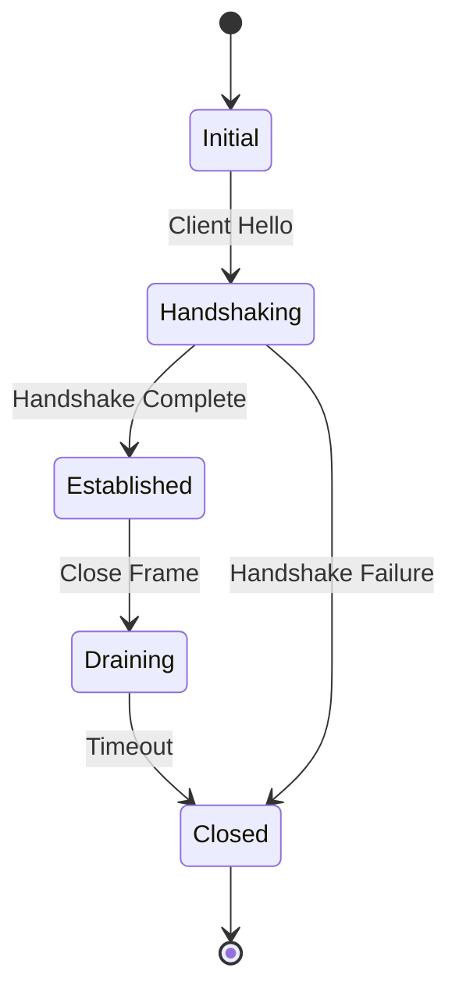

Understanding QuicD requires familiarity with both QUIC protocol fundamentals and QuicD's specific architectural patterns. This guide explains the key concepts you'll encounter when working with QuicD.

## QUIC Protocol Fundamentals

### Connection

A **QUIC connection** is a stateful communication channel between client and server, providing encrypted, reliable, multiplexed communication.

**Key characteristics:**
- **Identified by Connection ID (CID)**: Not tied to IP address/port (enables connection migration)
- **Always encrypted**: TLS 1.3 is mandatory, no plaintext QUIC
- **Multiplexed**: Multiple streams share single connection without head-of-line blocking
- **Long-lived**: Can survive network changes (Wi-Fi → cellular)

```rust
// Connections are identified by 128-bit IDs in QuicD
pub type ConnectionId = u128;

// Access connection info via ConnectionHandle
let conn_id = handle.connection_id();
let peer = handle.peer_addr();
let local = handle.local_addr();
```

### Stream

**Streams** are independent, ordered byte sequences within a connection. Think of them as TCP connections within a QUIC connection, but without head-of-line blocking.

**Types:**
- **Bidirectional**: Both peers can send and receive (e.g., HTTP request/response)
- **Unidirectional**: Only one peer sends data (e.g., HTTP/3 control stream, server push)

**Stream IDs:**
- Client-initiated bidirectional: 0, 4, 8, 12, ...
- Server-initiated bidirectional: 1, 5, 9, 13, ...
- Client-initiated unidirectional: 2, 6, 10, 14, ...
- Server-initiated unidirectional: 3, 7, 11, 15, ...

```rust
// Open a bidirectional stream
let request_id = handle.open_bi()?;

// Later, receive the stream handles
match event {
    AppEvent::StreamOpened { request_id, result } => {
        let (send, recv) = result?;
        // Use send/recv for data transfer
    }
    _ => {}
}
```

**Flow control**: Each stream has independent flow control limits, preventing one stream from monopolizing the connection.

### Frame

**Frames** are the atomic units of data within QUIC packets. You typically don't interact with raw frames in QuicD—Quiche handles framing—but understanding them helps with debugging.

**Common frame types:**
- `STREAM`: Carries stream data
- `ACK`: Acknowledges received packets
- `RESET_STREAM`: Aborts a stream with error code
- `MAX_DATA`: Updates connection-level flow control
- `CONNECTION_CLOSE`: Gracefully terminates connection

### Datagram

**Datagrams** are unreliable, unordered messages within a QUIC connection. They:
- Have no delivery guarantee (may be lost)
- Have no ordering guarantee
- Are not flow-controlled
- Ideal for real-time data (video, audio, gaming)

```rust
// Send a datagram (fire-and-forget)
let data = Bytes::from("Real-time update");
let request_id = handle.send_datagram(data)?;

// Receive datagrams
match event {
    AppEvent::Datagram { payload } => {
        process_realtime_data(payload);
    }
    _ => {}
}
```

**Size limits**: Datagrams must fit in a single QUIC packet (~1200 bytes typically).

---

## QuicD Architecture Concepts

### Worker Thread

A **worker thread** is a native OS thread responsible for network I/O and QUIC protocol processing for a subset of connections.

**Characteristics:**
- **Native thread**: Not a Tokio task—runs synchronous event loop
- **Dedicated resources**:
  - Own buffer pool (8K+ pre-allocated buffers)
  - Own io_uring instance (zero-copy I/O)
  - Own UDP socket (SO_REUSEPORT)
  - Own QUIC connection manager
- **CPU-pinned**: Bound to specific core for cache locality
- **Event-driven**: `io_uring::wait()` → process events → repeat
- **Zero shared state**: No locks, no contention with other workers

```toml
[netio]
workers = 8  # One per physical core recommended
```

**Analogy**: Think of workers as independent QUIC servers, each handling a portion of connections.

### App Task

An **app task** is an asynchronous Tokio task spawned per connection to implement application protocol logic (HTTP/3, MOQ, custom).

**Characteristics:**
- **One task per connection**: Each connection gets its own task
- **Async/await**: Uses Tokio runtime, can await I/O operations
- **Event-driven**: Reacts to `AppEvent` stream from worker
- **Commands**: Sends `EgressCommand` to worker for data transmission
- **Shared runtime**: All app tasks share Tokio thread pool

```rust
// App tasks receive events and process them
async fn spawn_app(
    handle: ConnectionHandle,
    mut events: AppEventStream,
    mut shutdown: ShutdownFuture,
) -> Result<(), ConnectionError> {
    loop {
        tokio::select! {
            Some(event) = events.next() => {
                // React to events (new streams, data, etc.)
            }
            _ = &mut shutdown => {
                // Graceful cleanup
                break;
            }
        }
    }
    Ok(())
}
```

**Why separate?** Worker threads need to be fast and synchronous (network I/O). App logic can be slow and async (database queries, external APIs). Separation prevents blocking.

### Application Registry

The **AppRegistry** maps ALPN (Application-Layer Protocol Negotiation) strings to application factories.

**Purpose**: Determines which application handles a connection based on TLS handshake negotiation.

```rust
let registry = AppRegistry::new()
    .register("h3", Arc::new(H3Factory::new(DefaultH3Handler)))
    .register("h3-29", Arc::new(H3Factory::new(DefaultH3Handler)))
    .register("moq", Arc::new(MOQFactory::new()));

// During handshake, ALPN "h3" is negotiated
// → Registry returns H3Factory
// → H3Factory spawns H3Session task for this connection
```

**ALPN negotiation**: Client proposes list (e.g., `["h3", "h3-29"]`), server picks first supported one.

### Event-Driven Communication

QuicD uses **event-driven patterns** to avoid blocking:

#### AppEvent (Worker → App)

Events flow from worker thread to app task via bounded channel:

```rust
pub enum AppEvent {
    HandshakeCompleted { alpn, local_addr, peer_addr, .. },
    NewStream { stream_id, recv_stream, send_stream, .. },
    StreamReadable { stream_id },  // Hint: data available
    Datagram { payload },
    ConnectionClosing { error_code, reason },
    // ... command responses
}
```

**Edge-triggered**: `StreamReadable` fires when data becomes available, not continuously.

#### EgressCommand (App → Worker)

Commands flow from app task to worker thread:

```rust
pub enum EgressCommand {
    OpenBi { request_id, connection_id },
    OpenUni { request_id, connection_id },
    SendDatagram { request_id, connection_id, data },
    ResetStream { stream_id, error_code, .. },
    Close { connection_id, error_code, reason },
    // ...
}
```

**Non-blocking**: Commands are sent via `try_send()`. If channel is full, returns error immediately.

**Request correlation**: Commands include `request_id`, responses arrive as `AppEvent` with matching ID.

---

## Zero-Copy Architecture

QuicD minimizes memory copies for performance. Understanding this helps optimize application code.

### bytes::Bytes

The `bytes` crate provides **reference-counted, immutable byte buffers**:

```rust
use bytes::Bytes;

let data = Bytes::from("Hello, QUIC!");

// Cloning is O(1) - increments ref count, no data copy
let data_clone = data.clone();

// Both point to same underlying memory
assert_eq!(data.as_ptr(), data_clone.as_ptr());
```

**Usage in QuicD:**
- `RecvStream::read()` returns `StreamData::Data(Bytes)`
- `SendStream::write()` accepts `Bytes`
- `send_datagram()` accepts `Bytes`

**Best practice**: Avoid converting to `Vec<u8>` unless mutation is needed. Use `Bytes::slice()` for subsets.

### Buffer Pool

Workers maintain pre-allocated buffer pools:

1. **Startup**: Allocate 8K buffers × 2KB each = 16MB pool
2. **Packet arrives**: Acquire buffer from pool (O(1) after warmup)
3. **Process packet**: Pass buffer reference through layers
4. **Transmit**: Reuse buffer for outgoing data
5. **Completion**: Return buffer to pool

**Zero allocation** in steady state—all buffers reused.

---

## Connection Lifecycle

Understanding the connection lifecycle helps with debugging and proper resource management.



### Phases

**1. Initial / Handshaking**
- Client sends Initial packet with TLS Client Hello
- Server responds with Initial packet (Server Hello, certificates)
- ALPN negotiation occurs here
- Worker thread handles this synchronously

**2. Handshake Complete**
- TLS 1.3 handshake succeeds
- Worker emits `AppEvent::HandshakeCompleted`
- App task is spawned via `QuicAppFactory::spawn_app()`
- Connection is now ready for streams

**3. Established**
- Normal data transfer: streams, datagrams
- App task processes `AppEvent::NewStream`, reads/writes data
- Connection may remain open for hours (HTTP/3 persistent connections)

**4. Closing / Draining**
- Either peer sends CONNECTION_CLOSE frame
- Worker emits `AppEvent::ConnectionClosing`
- App task has 30 seconds to clean up
- No new streams can be opened

**5. Closed**
- Connection state is freed
- App task terminates
- Resources (buffers, memory) are released

### Graceful Shutdown

When QuicD receives a shutdown signal (SIGINT):

1. **Main thread** sets shutdown flag
2. **Workers** stop accepting new connections
3. **Existing connections** receive `AppEvent::ConnectionClosing`
4. **App tasks** have 30 seconds to finish
5. **Workers** wait for all connections to close
6. **Tokio runtime** shuts down
7. Process exits

---

## Extensibility Model

QuicD's power comes from its pluggable application layer.

### QuicAppFactory Trait

Implement this trait to add new protocols:

```rust
#[async_trait]
pub trait QuicAppFactory: Send + Sync + 'static {
    /// Returns true if this factory handles the given ALPN
    fn accepts_alpn(&self, alpn: &str) -> bool;
    
    /// Spawns the application task for a new connection
    async fn spawn_app(
        &self,
        alpn: String,
        handle: ConnectionHandle,
        events: AppEventStream,
        transport: TransportControls,
        shutdown: ShutdownFuture,
    ) -> Result<(), ConnectionError>;
}
```

### Implementation Pattern

```rust
use async_trait::async_trait;
use quicd_x::{QuicAppFactory, ConnectionHandle, AppEventStream, ShutdownFuture};

struct EchoFactory;

#[async_trait]
impl QuicAppFactory for EchoFactory {
    fn accepts_alpn(&self, alpn: &str) -> bool {
        alpn == "echo"
    }
    
    async fn spawn_app(
        &self,
        alpn: String,
        handle: ConnectionHandle,
        mut events: AppEventStream,
        _transport: TransportControls,
        mut shutdown: ShutdownFuture,
    ) -> Result<(), ConnectionError> {
        use futures::StreamExt;
        
        loop {
            tokio::select! {
                Some(event) = events.next() => {
                    match event {
                        AppEvent::NewStream { recv_stream, send_stream, .. } => {
                            if let Some(send) = send_stream {
                                // Echo pattern: read and write back
                                while let Ok(Some(data)) = recv_stream.read().await {
                                    if let StreamData::Data(bytes) = data {
                                        send.write(bytes, false).await?;
                                    }
                                }
                                send.finish().await?;
                            }
                        }
                        AppEvent::ConnectionClosing { .. } => break,
                        _ => {}
                    }
                }
                _ = &mut shutdown => break,
            }
        }
        Ok(())
    }
}
```

### Registration

```rust
// In main.rs
let registry = AppRegistry::new()
    .register("echo", Arc::new(EchoFactory));
```

**That's it!** QuicD handles network I/O, QUIC protocol, connection routing. You implement application logic.

---

## Performance Concepts

### Backpressure

**Backpressure** is the mechanism preventing fast producers from overwhelming slow consumers.

**In QuicD:**
- Channels have bounded capacity (1024 events, 256 stream chunks)
- If app task is slow reading, ingress channel fills
- Worker blocks on channel send (backpressure to QUIC flow control)
- QUIC tells client to slow down

**Tuning:** Increase channel capacities if you see "channel full" warnings, but investigate why app is slow first.

### Connection Affinity (eBPF)

**Problem:** Without affinity, packets for a connection could arrive at different workers, causing cache misses and state synchronization overhead.

**Solution:** eBPF program in kernel routes packets by DCID to specific worker socket.

**Benefit:** All packets for a connection hit same CPU cache → 2-3x throughput improvement.

```bash
# eBPF routing is mandatory in QuicD (requires root)
sudo quicd --config config.toml
```

---

## Next Steps

Now that you understand the concepts:

- **Install QuicD**: See [Installation Guide](/getting-started/installation/)
- **Run HTTP/3 server**: Jump to [HTTP/3 Usage](/usage/http3/)
- **Build custom protocol**: Read [Application Interface](/building-apps/interface/)
- **Dive into architecture**: Explore [Architecture](/architecture/) for implementation details

---

*Mastering these concepts enables you to build high-performance, scalable QUIC applications with QuicD. The event-driven, zero-copy design is the key to exceptional performance.*
