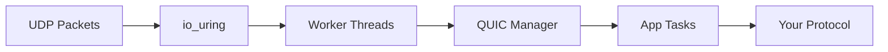

import { Card, CardGrid } from '@astrojs/starlight/components';
import StructuredData from '../../components/StructuredData.astro';

<StructuredData />

## Why QuicD?

QuicD combines cutting-edge Linux technologies with Rust's safety guarantees to deliver exceptional performance for QUIC-based applications.

<CardGrid>
  <Card title="Zero-Copy Performance" icon="rocket">
    io_uring and eBPF routing eliminate contention. Handle **100K+ connections** per worker with minimal latency.
  </Card>
  
  <Card title="Pluggable Applications" icon="puzzle">
    Implement `QuicAppFactory` to add any protocol. Built-in HTTP/3, plus Media over QUIC (MOQ) coming soon.
  </Card>
  
  <Card title="Rust Safety" icon="seti:rust">
    Memory-safe concurrent code without garbage collection overhead. The borrow checker prevents entire classes of bugs.
  </Card>
  
  <Card title="Observable" icon="magnifier">
    OpenTelemetry metrics and tracing built-in. Monitor RTT, throughput, and connection states in real-time.
  </Card>
</CardGrid>

## Quick Start

Install QuicD and run your first HTTP/3 server in minutes:

```bash
# Clone and build
git clone https://github.com/gh-abhay/quicd.git
cd quicd
cargo build --release

# Run server (requires root for eBPF)
sudo ./target/release/quicd --config config.toml

# Test with example client
cargo run --example h3_client
```

## Use Cases

<CardGrid stagger>
  <Card title="HTTP/3 Web Serving" icon="laptop">
    Serve modern web applications with built-in HTTP/3 and QPACK header compression. Drop-in replacement for HTTP/2 servers.
  </Card>
  
  <Card title="Low-Latency Media Streaming" icon="star">
    Build Media over QUIC applications for live video, audio, or real-time communication with sub-second latency.
  </Card>
  
  <Card title="Custom QUIC Protocols" icon="setting">
    Implement domain-specific protocols for gaming, IoT, DNS over QUIC, or research without modifying the core server.
  </Card>
</CardGrid>

## Architecture Highlights

QuicD's architecture separates concerns for optimal performance:

- **Native worker threads**: Handle network I/O and QUIC protocol (synchronous, event-driven)
- **Tokio async runtime**: Run application logic (one task per connection)
- **Zero-copy channels**: Efficient communication via `bytes::Bytes`
- **eBPF routing**: Connection affinity for cache efficiency



[Learn more about the architecture →](/architecture/)

## What's Next?

<CardGrid>
  <Card title="Read the Docs" icon="open-book">
    Explore comprehensive guides on installation, configuration, and building applications.
    
    [Introduction →](/introduction/)
  </Card>
  
  <Card title="Build an App" icon="puzzle">
    Implement the `QuicAppFactory` trait to create custom QUIC-based protocols.
    
    [Application Interface →](/building-apps/interface/)
  </Card>
  
  <Card title="Contribute" icon="github">
    QuicD is open source. Report issues, contribute code, or improve documentation.
    
    [Contributing Guide →](/community/contributing/)
  </Card>
</CardGrid>

---

import { LinkButton } from '@astrojs/starlight/components';

<div style="text-align: center; margin-top: 4rem; padding: 2rem; background: var(--sl-color-bg-inline-code); border-radius: 0.75rem; border: 1px solid var(--sl-color-gray-5);">
  <h3 style="margin-top: 0;">Ready to build?</h3>
  <p style="color: var(--sl-color-gray-2); margin-bottom: 1.5rem;">Install QuicD and start serving QUIC traffic in minutes.</p>
  <div style="display: flex; gap: 1rem; justify-content: center; flex-wrap: wrap;">
    <LinkButton href="/getting-started/installation/" variant="primary" icon="right-arrow">Get Started</LinkButton>
    <LinkButton href="https://github.com/gh-abhay/quicd" variant="secondary" icon="github">View Source</LinkButton>
  </div>
</div>
